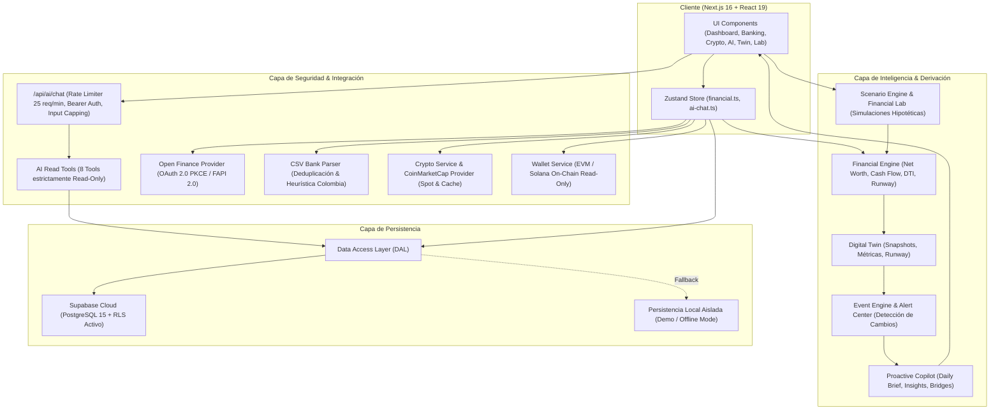

# 🏛️ NEXUS Finance — Arquitectura del Sistema

Este documento describe la arquitectura modular, los flujos de datos y los principios de diseño implementados en **NEXUS Finance**.

---

## 1. Diagrama de Flujo del Sistema

---

## 2. Capa Contable (Financial Engine)

El motor financiero ([`financial-engine.ts`](file:///c:/Users/kevin/.gemini/antigravity-ide/scratch/nexus-finance/app/src/lib/financial-engine.ts)) es determinista, puro y sin dependencias de base de datos.

### 2.1 Ecuaciones e Invariantes Fundamentales:

1. **Patrimonio Neto (Net Worth):**
   $$\text{Net Worth} = \text{Total Activos} - \text{Total Pasivos}$$
   
2. **Deduplicación de Activos:**
   Cuando existen balances verificados provenientes de Open Finance o tenencias de criptoactivos en vivo, el motor financiero sustituye y descuenta automáticamente los activos legacy manuales categorizados en `bank_accounts` o `crypto`, previniendo la duplicación contable:
   $$\text{Activos Ajustados} = \text{Manuales} - \text{LegacyBancos} + \text{BancosOpenFinance} - \text{LegacyCrypto} + \text{CryptoLive}$$

3. **Flujo de Caja Real (Banking Cash Flow):**
   $$\text{Net Cash Flow} = \text{Ingresos Operativos} - \text{Gastos Reales}$$
   Las transferencias internas entre cuentas propias (ej. de cuenta de ahorros Bancolombia a cuenta Nequi) se identifican automáticamente mediante `is_internal_transfer = true` y son excluidas de los ingresos y egresos, registrándose exclusivamente en el volumen de transferencias internas:
   $$\text{Volumen Transferencias Internas} = \sum \text{Monto}_{\text{transferencias}}$$

4. **Pago de Deuda:**
   El pago de pasivos reduce el efectivo y disminuye los pasivos en la misma magnitud, manteniendo el patrimonio neto neutro en el instante de la transacción.

5. **Revalorización Cripto:**
   Las fluctuaciones de precio en criptoactivos se contabilizan como **Rendimiento No Realizado (PnL)** y nunca como ingreso operacional realizado.

---

## 3. Data Access Layer (DAL) & Modo Dual

El acceso a datos se centraliza en `src/lib/dal/`:
- **Modo Supabase Cloud:** Cuando las variables `NEXT_PUBLIC_SUPABASE_URL` y `NEXT_PUBLIC_SUPABASE_ANON_KEY` están configuradas, las operaciones se delegan a Supabase, donde **Row Level Security (RLS)** garantiza que cada consulta incluye `auth.uid() = user_id`.
- **Modo Demo / Local:** Si Supabase no está configurado o el cliente está offline, el DAL conmuta fluidamente a almacenamiento local en el navegador, manteniendo todas las funcionalidades intactas de manera aislada.

---

## 4. Arquitectura de Inteligencia Artificial (NEXUS AI)

El copiloto opera mediante un modelo de **Tres Pilares**:

1. **Grounded en Financial Engine:** El LLM (Google Gemini) nunca calcula métricas patrimoniales o de presupuesto en su contexto latente; está forzado mediante `tool_calls` a consultar las herramientas oficiales del Financial Engine.
2. **Herramientas de Solo Lectura:** El despachador de herramientas (`src/lib/ai-tools/`) solo expone 8 herramientas de lectura (`get_monthly_income`, `get_monthly_expenses`, `get_net_worth`, `get_debts`, `get_budgets`, `get_financial_state`, `simulate_financial_scenario`, `get_nexus_today`). Ninguna herramienta permite ejecutar INSERT, UPDATE, DELETE o consultas SQL arbitrarias.
3. **Seguridad y Rate Limiting:** La ruta `/api/ai/chat/route.ts` implementa:
   - Rate limiting in-memory por ventana deslizante (máximo 25 peticiones por minuto por IP/usuario con respuesta HTTP 429).
   - Verificación del token Bearer de Supabase (`supabase.auth.getUser`) para impedir la suplantación del `userId`.
   - Límites en la longitud de entrada (máximo 4.000 caracteres por mensaje y 20 turnos de historial).

---

## 5. Arquitectura Cripto & Web3

- **Modo Estrictamente Read-Only:** La aplicación solo almacena direcciones públicas (Ethereum/Solana) y nombres de plataformas. Cero llaves privadas, frases semilla o capacidades de firma/envío.
- **Resiliencia de Mercado:** `CryptoService` gestiona cotizaciones en vivo mediante `CoinMarketCapProvider` con caché spot de 5 minutos, caché histórica de 30 minutos y fallback determinista instantáneo ante respuestas 429 o caídas de red.

---

## 6. Arquitectura Bancaria & Open Finance

- **Conforme al Decreto 0368 de 2026:** Integración basada en estándares abiertos colombianos (FAPI 2.0 / OAuth 2.0 PKCE).
- **Zero Credenciales:** El sistema rechaza activamente cualquier intento de ingresar contraseñas bancarias o PINs.
- **Importación de Extractos CSV:** Soporte nativo para extractos de Bancolombia, Davivienda, Nu y Nequi, con normalización heurística de columnas, detección de moneda en formato colombiano (puntos de miles y comas de decimales), prevención de duplicados y confirmación obligatoria previa a la importación.
